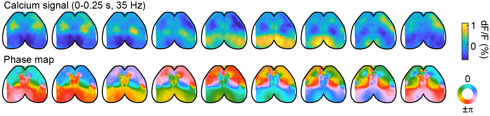
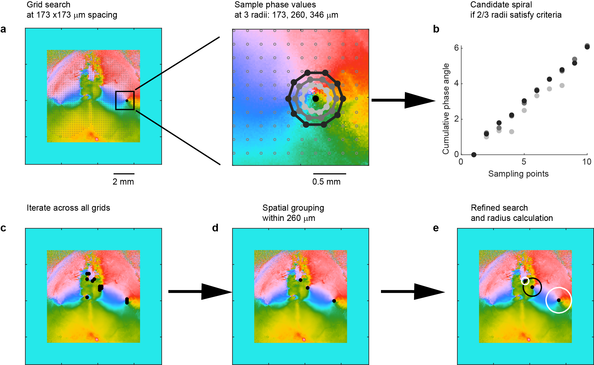

# YE-et-al-2023-spirals

## Description
This repository contains code for all figures in [Ye et al, 2023b](https://doi.org/10.1101/2023.12.07.570517).




## Code Organization 
The preprocessing workflows are described in `pipline1/2/3/4/5/6.m` files in the root folder; 
while the figure plotting functions are organized in the `figure1/2/3/4/5/6.m` files.

The preprocessing workflows (`pipline1/2/3/4/5/6.m`) sometimes take a long time to run. Therefore, the results of the preprocessing steps are saved in data folder, ahead of time.
The figure ploting functions (`figure1/2/3/4/5/6.m`) use preprocessed data to generate final plots within minutes if not seconds, after specifying the root data folder.

These `pipline1/2/3/4/5/6.m` and `figure1/2/3/4/5/6.m` files also provide an overview of the code organizing structure, following the figure indexes in the preprint. Key algorithms are described in details on top of each function, such as spiral detection algorithm. For extra information, please refer to the manuscript.


## Data download
The raw and preprocessed data are divided into 4 parts, and shared on figshare.
They are all listed on this page with DOI: https://doi.org/10.6084/m9.figshare.27850707

You can also find the 4 parts seperately below.

Part1/4 (widefield data): https://doi.org/10.6084/m9.figshare.25884259

Part2/4 (widefield + ephys data): https://doi.org/10.6084/m9.figshare.25884280

Part3/4 (whisker-evoked widefield data): https://doi.org/10.6084/m9.figshare.31385869

Part4/4 (visual-motor behavior widefield data): https://doi.org/10.6084/m9.figshare.27850542

In total, 4 parts together require 75 GB disk space after unzipping.
After downloading and unzipping all repositories, place all 7 subfolders under a root data folder.

The code here will look for data inputs from these subfolders, after specifying the root data folder in the beginning of each main script.

## Data overview
We prepared a short script `data_overview.m` in the root, to help quickly navigate the raw data in the data folder.


## Spiral detection algorithm
The main functions for spiral detection are listed in the beginning of `pipeline1_spirals.m`, 
which are `getSpiralDetection.m` and `getSpiralGrouping.m`.




## Spiral simulation with coupled oscillators
We provide python scripts for isotropic model, circular bias model and mirror symmetry model.

Instructions
```bash
# locate to folders with code
cd root/simulation
# Create new virtual environment
conda env create --file requirements.yaml
# Activate the environment
conda activate spiralSim
# open jupyter notebook and navitage to spiral_examples.ipynb
jupyter notebook
```

